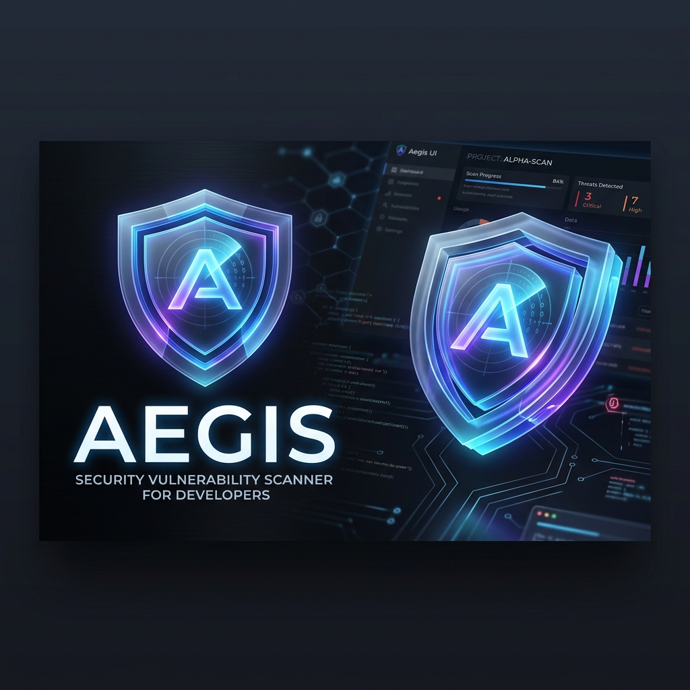

<div align="center">
  
  <h1>🛡️ Aegis</h1>
  <p><b>Plateforme moderne et unifiée pour le scan, le triage et la gestion des vulnérabilités de dépendances.</b></p>
</div>

<br />

## 🚀 À propos

**Aegis** est un scanner de vulnérabilités ("vulnerability scanner") pensé pour les développeurs et les référents sécurité (AppSec). Conçu avec un design system ultra-premium *(Glassmorphism, animations fluides, dark mode natif)*, Aegis consolide les résultats de multiples outils d'audit (`npm audit`, `yarn audit`, `bun audit`, `composer audit`) au sein d'une seule interface centralisée et agréable à utiliser.

Finies les lignes de terminal illisibles ! Avec Aegis, repérez instantanément les failles critiques et prenez des décisions rapides grâce au module de triage.

---

## ✨ Fonctionnalités Phares

- **🌐 Ingénierie Glocale** : Scannez vos projets locaux (par chemin de dossier) ou ingérez les rapports de vulnérabilité distants poussés par vos pipelines CI/CD.
- **🔍 Module de Triage Centralisé** : Passez en revue toutes vos CVEs dans une boîte de réception type "Inbox Zero". Marquez les failles comme `En attente`, `Confirmées` (Urgent), `Non affectées` (Faux positif) ou `Ignorées`.
- **📊 Tableaux de Bord & Rapports** : Suivez l'historique de votre écosystème avec des graphiques évolutifs temporels (vue 1h, 1j, 7j, 30j...) et générez des rapports d'audit globaux sur tous vos projets en un clic.
- **🎨 Design UI/UX Premium** : Interface construite en React + TailwindCSS exploitant massivement les effets de flou (backdrop-blur), les animations de layout fluides, et une typographie soignée pour une expérience utilisateur sans friction.
- **🤖 Bibliothèque de Prompts** : Espace dédié pour stocker vos prompts IA d'aide à la remédiation de sécurité.
- **🔌 Intégration Jira (En Chantier)** : Support natif prévu pour la génération automatisée de tickets Atlassian Jira directement depuis l'interface de triage des CVEs.
- **🔗 GitHub Advisory Data** : Enrichissement automatique des données de failles via l'API GitHub Advisory.

---

## 🛠️ Stack Technique

- **Moteur (Backend)** : [Bun](https://bun.com/) (Hautes performances)
- **Base de Données** : SQLite (via `bun:sqlite` - léger et natif)
- **Frontend** : React 18, React Router, Recharts
- **Style** : TailwindCSS (Vanilla, architecture orientée Glassmorphism), Lucide React pour l'iconographie

---

## ⚙️ Installation & Démarrage

```bash
# 1. Cloner le projet (si applicable)
git clone https://github.com/votre-org/aegis.git
cd aegis

# 2. Installer les dépendances via Bun
bun install

# 3. Lancer le serveur de développement (Backend + Frontend)
bun dev
```

L'application sera accessible sur `http://localhost:3000` (ou le port configuré). La base de données SQLite `aegis.db` sera créée automatiquement à la racine.

---

## 📡 Intégration CI (Ingest API)

Aegis permet de stocker les rapports de vulnérabilités générés par vos pipelines CI/CD (GitHub Actions, GitLab CI, Jenkins, etc.) pour les centraliser sur le dashboard. 

Pour cela, envoyez la sortie standard (`stdout`) de votre outil d'audit (`npm audit --json`, etc.) à l'API d'ingestion en spécifiant le paramètre `sha` pour lier le rapport à un commit précis.

**Exemple d'appel cURL :**
```bash
curl -X POST "http://aegis-server/api/ingest/mon-projet-slug?sha=VOTRE_HASH_DE_COMMIT" \
     -H "Content-Type: application/json" \
     --data-binary @rapport-audit.json
```
*Note : Le paramètre `sha` est primordial pour que les développeurs retrouvent la révision exacte du code liée aux vulnérabilités identifiées.*

---

## 🔐 Philosophie

Aegis a été créé pour transformer l'analyse des dépendances — souvent vue comme une corvée génératrice de bruit — en une expérience visuelle, centralisée et engageante. Notre but : réduire la charge cognitive des ingénieurs sécurité.
